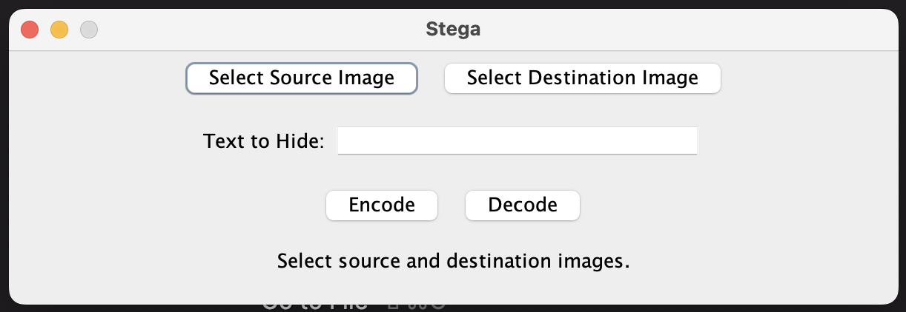

<div align="center">
  <h3 align="center">Stega</h3>

  <p align="center">
    Simple steganography tool to hide text in images.
    <br />
    <a href="https://github.com/filippofinke/Stega"><strong>Explore the docs »</strong></a>
    <br />
    <br />
    <a href="https://github.com/filippofinke/Stega/issues">Report Bug</a>
    ·
    <a href="https://github.com/filippofinke/Stega/issues">Request Feature</a>
  </p>
</div>



## About The Project

This project is a simple steganography tool that allows you to hide text within images. It provides methods to hide text in an image file and retrieve hidden text from an image file. The hiding process is done by modifying the least significant bit of each byte in the image, allowing for minimal visual impact on the image itself.

## Getting Started

To use this steganography tool, you can download the source code and compile it using Java. 

To compile it using maven, run the following command:

```sh
mvn clean package
```

The main class is `Main`, which provides methods for hiding and revealing text. You can run the program from the command line with the following options:

- To hide text: `java -jar stega.jar "text" sourceImage destinationImage`
- To reveal text: `java -jar stega.jar sourceImage`

Replace `stega.jar` with the name of the compiled JAR file.

Otherwise you can double click the JAR file to run the program with a GUI.

## Contributing

Contributions are welcome! If you have suggestions or improvements for the project, you can fork the repository, make your changes, and create a pull request. You can also open an issue to report bugs or request new features.

To contribute to this project, follow these steps:

1. Fork the Project
2. Create your Feature Branch (`git checkout -b feature/AmazingFeature`)
3. Commit your Changes (`git commit -m 'Add some AmazingFeature'`)
4. Push to the Branch (`git push origin feature/AmazingFeature`)
5. Open a Pull Request

## License

Stega is released under the MIT License. See the [LICENSE](LICENSE) file for more details.

## Author

👤 **Filippo Finke**

- Website: [https://filippofinke.ch](https://filippofinke.ch)
- Github: [@filippofinke](https://github.com/filippofinke)
- LinkedIn: [@filippofinke](https://linkedin.com/in/filippofinke)

## Show your support

Give a ⭐️ if this project helped you!

<a href="https://www.buymeacoffee.com/filippofinke">
  
</a>
